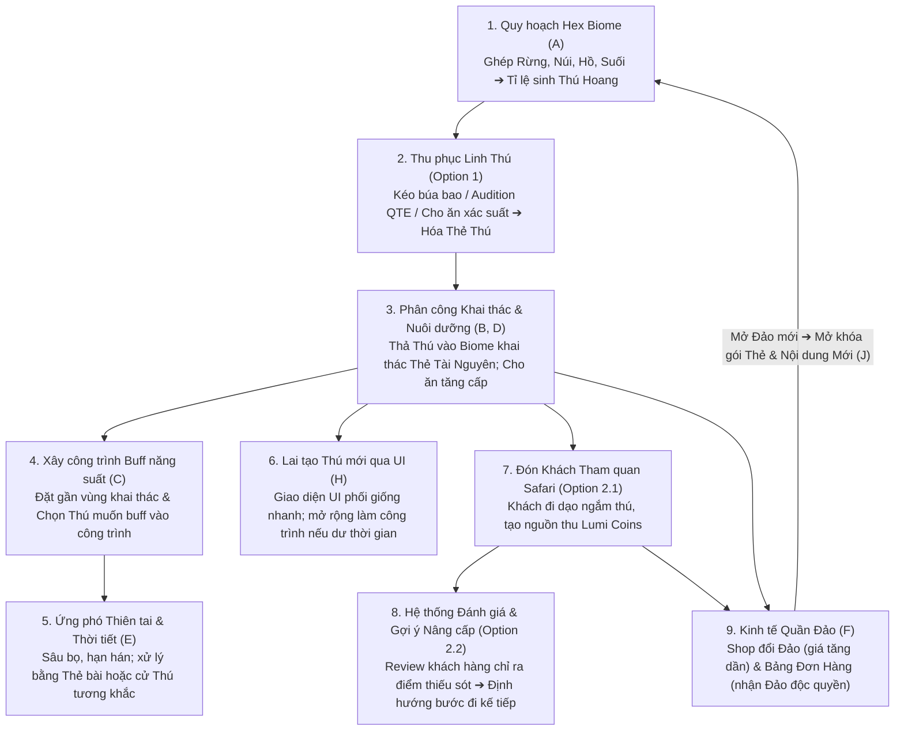
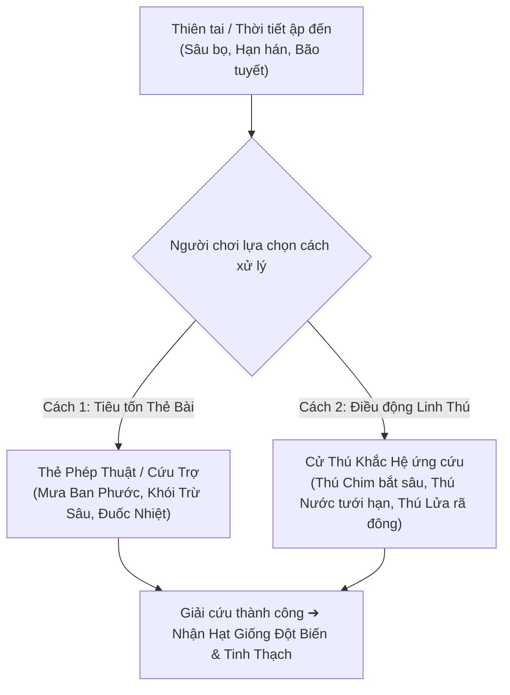
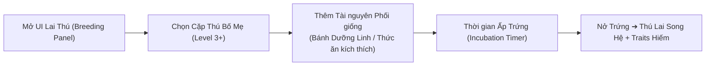
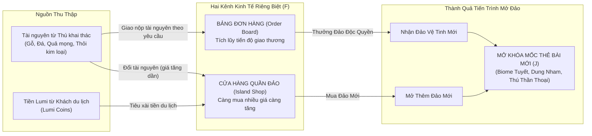

# TÀI LIỆU ĐẶC TẢ THIẾT KẾ GAME (GAME DESIGN DOCUMENT - GDD SPECIFICATION)

---

## THÔNG TIN TÀI LIỆU (DOCUMENT CONTROL)

| Trường thông tin | Giá trị chi tiết |
| :--- | :--- |
| **Tên dự án** | **LumiWorld** |
| **Loại tài liệu** | Master Game Design Document (GDD Specification) |
| **Phiên bản (Version)** | **1.2.0** |
| **Trạng thái (Status)** | **Active Specification (Đang triển khai)** |
| **Thể loại (Genre)** | Hex Diorama Builder / Creature Worker Placement / Eco-Safari Tycoon / Card Engine |
| **Nền tảng mục tiêu (Platforms)** | PC (Steam - Chuột/Phím), Mobile (iOS / Android - Cảm ứng) |
| **Phong cách đồ họa (Art Style)** | 3D Toy Diorama, bề mặt kẹo dẻo bo tròn mượt mà, bảng màu pastel ấm áp (*Preserve*, *Slime Rancher*) |
| **Đối tượng sử dụng** | Game Designers, Unity Developers, 3D Artists, UI/UX Designers |

---

## MỤC LỤC TÀI LIỆU (TABLE OF CONTENTS)

1. [TỔNG QUAN HỆ THỐNG & ĐỊNH HƯỚNG SẢN PHẨM](#1-tổng-quan-hệ-thống--định-hướng-sản-phẩm)
2. [KIẾN TRÚC VÒNG LẶP CỐT LÕI (CORE GAME LOOPS)](#2-kiến-trúc-vòng-lặp-cốt-lõi-core-game-loops)
3. [ĐẶC TẢ HỆ THỐNG THẺ BÀI (CARD ENGINE SPECIFICATION)](#3-đặc-tả-hệ-thống-thẻ-bài-card-engine-specification)
4. [ĐẶC TẢ CÁC PHÂN HỆ CHƠI ĐƠN (SINGLEPLAYER FEATURE SPECIFICATIONS)](#4-đặc-tả-các-phân-hệ-chơi-đơn-singleplayer-feature-specifications)
   - [4.1. Phân hệ A: Quy hoạch Địa hình Lục giác (Hex Biome Engine)](#41-phân-hệ-a-quy-hoạch-địa-hình-lục-giác-hex-biome-engine)
   - [4.2. Phân hệ B & D: Nhân công Linh thú & Hệ thống Nuôi dưỡng (Worker & Progression)](#42-phân-hệ-b--d-nhân-công-linh-thú--hệ-thống-nuôi-dưỡng-worker--progression)
   - [4.3. Phân hệ C: Công trình & Cơ chế Hào quang Buff (Building & Aura Buff System)](#43-phân-hệ-c-công-trình--cơ-chế-hào-quang-buff-building--aura-buff-system)
   - [4.4. Phân hệ E: Vật cản - Thiên tai & Thời tiết Động (Disaster & Dynamic Weather System)](#44-phân-hệ-e-vật-cản---thiên-tai--thời-tiết-động-disaster--dynamic-weather-system)
   - [4.5. Phân hệ H: Hệ thống Lai Thú (UI-Based Breeding System)](#45-phân-hệ-h-hệ-thống-lai-thú-ui-based-breeding-system)
5. [ĐẶC TẢ CƠ CHẾ THU PHỤC THÚ HOANG (TAMING SYSTEM - OPTION 1)](#5-đặc-tả-cơ-chế-thu-phục-thú-hoang-taming-system---option-1)
   - [5.1. Minigame 1: Kéo - Búa - Bao (Rock-Paper-Scissors)](#51-minigame-1-kéo---búa---bao-rock-paper-scissors)
   - [5.2. Minigame 2: Vũ điệu Nhịp điệu Audition (Rhythm Arrow / QTE)](#52-minigame-2-vũ-điệu-nhịp-điệu-audition-rhythm-arrow--qte)
   - [5.3. Minigame 3: Thu phục Xác suất bằng Cho Ăn Tài Nguyên (Feeding Probability)](#53-minigame-3-thu-phục-xác-suất-bằng-cho-ăn-tài-nguyên-feeding-probability)
   - [5.4. Quy trình Chuyển hóa Thẻ Linh Thú (Card Conversion)](#54-quy-trình-chuyển-hóa-thẻ-linh-thú-card-conversion)
6. [ĐẶC TẢ HỆ THỐNG DU LỊCH & ĐÁNH GIÁ ĐẢO (SAFARI & REVIEWS - OPTION 2.1 & 2.2)](#6-đặc-tả-hệ-thống-du-lịch--đánh-giá-đảo-safari--reviews---option-21--22)
   - [6.1. Hệ thống Khách Tham Quan Safari (Jurassic Park Style - Option 2.1)](#61-hệ-thống-khách-tham-quan-safari-jurassic-park-style---option-21)
   - [6.2. Hệ thống Đánh Giá Đảo & Nhật Ký Gợi Ý Nâng Cấp (Smart Progression - Option 2.2)](#62-hệ-thống-đánh-giá-đảo--nhật-ký-gợi-ý-nâng-cấp-smart-progression---option-22)
7. [ĐẶC TẢ TIẾN TRÌNH KINH TẾ & MỞ RỘNG QUẦN ĐẢO (ECONOMY & PROGRESSION - F & J)](#7-đặc-tả-tiến-trình-kinh-tế--mở-rộng-quần-đảo-economy--progression---f--j)
   - [7.1. Cửa Hàng Quần Đảo (Island Shop) - Cơ chế Giá Tăng Dần (Scaling Cost)](#71-cửa-hàng-quần-đảo-island-shop---cơ-chế-giá-tăng-dần-scaling-cost)
   - [7.2. Bảng Đơn Hàng Giao Thương (Order Board)](#72-bảng-đơn-hàng-giao-thương-order-board)
   - [7.3. Mốc Tiến Trình Mở Khóa Nội Dung (Milestone Progression - J)](#73-mốc-tiến-trình-mở-khóa-nội-dung-milestone-progression---j)
8. [CẤU TRÚC DỮ LIỆU KỸ THUẬT (DATA SCHEMA & CONFIG SAMPLES)](#8-cấu-trúc-dữ-liệu-kỹ-thuật-data-schema--config-samples)
9. [ĐẶC TẢ GIAO DIỆN NGƯỜI DÙNG (UI/UX SPECIFICATIONS)](#9-đặc-tả-giao-diện-người-dùng-uiux-specifications)
10. [LỘ TRÌNH PHÁT TRIỂN & PHÂN KỲ DỰ ÁN (DEVELOPMENT ROADMAP)](#10-lộ-trình-phát-triển--phân-kỳ-dự-án-development-roadmap)

---

## 1. TỔNG QUAN HỆ THỐNG & ĐỊNH HƯỚNG SẢN PHẨM

### 1.1. High Concept
**LumiWorld** là tựa game mô phỏng quản lý sinh thái diorama 3D thư giãn kết hợp cơ chế thẻ bài kéo-thả. Người chơi mở rộng hòn đảo lục giác, thu phục các sinh vật thần tiên đáng yêu thông qua các tương tác minigame độc đáo, giao việc cho thú trực tiếp khai thác tài nguyên, xây dựng công trình buff hào quang, đối phó thiên tai bất ngờ và vận hành một khu bảo tồn sinh thái hoang dã đón khách tham quan thu tiền Lumi Coins.

### 1.2. 4 Trụ Cột Thiết Kế (Design Pillars)
1. **Linh thú là Thực thể Lao động (Living Workers)**: Thú không đứng yên trang trí; thú trực tiếp cuốc xới, khai thác tài nguyên và chống chọi thiên tai.
2. **Cơ chế Thu phục Phi Bạo Lực Đa Dạng (Playful Non-Combat Taming)**: 3 minigame thân thiện (Kéo búa bao, Gõ nhịp Audition, Cho ăn xác suất).
3. **Mô hình Công viên Du lịch Hoang dã (Eco-Safari Tycoon)**: Lấy cảm hứng từ *Jurassic Park*, khách đi dạo ngắm thú, tạo dòng tiền và gửi feedback gợi ý nâng cấp đảo.
4. **Nguy cơ Sinh tồn & Thiên tai Động (DST Survival Elements)**: Thời tiết khắc nghiệt, sâu bọ cắn phá; giải quyết linh hoạt bằng Thẻ bài phép hoặc Cử Thú tương khắc.

---

## 2. KIẾN TRÚC VÒNG LẶP CỐT LÕI (CORE GAME LOOPS)

### 2.1. Sơ đồ Vòng lặp Tổng thể



### 2.2. Phân cấp 3 Tầng Vòng Lặp (Loop Hierarchy)
- **Micro-Loop (10–30 giây)**: Rút thẻ ➔ Ghép ô Hex ➔ Cho thú ăn ➔ Thu thập thẻ tài nguyên rơi ra ➔ Nhấn nhịp thu phục thú.
- **Meso-Loop (2–5 phút)**: Dựng công trình buff hào quang ➔ Phối giống cặp thú qua UI ➔ Dập tắt đợt thiên tai/sâu bọ ➔ Mở rộng đường mòn đón khách ➔ Đọc đánh giá gợi ý của du khách.
- **Macro-Loop (15–45 phút)**: Trả đơn hàng lớn ➔ Mua quyền mở đảo mới từ Shop (giá tăng dần) ➔ Mở khóa Mốc Thẻ Mới (J) ➔ Thiết lập thuộc địa diorama mới.

---

## 3. ĐẶC TẢ HỆ THỐNG THẺ BÀI (CARD ENGINE SPECIFICATION)

Toàn bộ thao tác của người chơi được trừu tượng hóa thành các **Thẻ Bài Tương Tác (Draggable Cards)**:

| Loại Thẻ (Card Type) | Đầu vào (Input) | Thao tác (Action) | Đầu ra / Tác dụng (Output) |
| :--- | :--- | :--- | :--- |
| **TerrainCard (Địa hình)** | Ô lục giác trống | Kéo thả vào lưới Hex | Tạo ô môi trường mới (Rừng, Suối, Núi...); kích hoạt Adjacency Bonus & tỉ lệ sinh thú hoang. |
| **CreatureCard (Linh thú)** | Thẻ thú trong kho | Kéo thả vào Biome / Công trình | - Thả vào Biome: Bắt đầu khai thác tài nguyên.<br>- Thả vào Công trình: Trở thành Quản đốc buff năng suất. |
| **BuildingCard (Công trình)** | Đất bằng phẳng | Kéo thả vào ô hợp lệ | Dựng khung giàn giáo; sau khi hoàn tất sẽ cấp slot buff cho thú. |
| **ResourceCard (Tài nguyên)** | Thẻ tài nguyên trong kho | Kéo thả vào Thú / Công trình / Đơn hàng | - Thả vào Thú: Tăng EXP (Level Up).<br>- Thả vào Giàn giáo: Cung cấp vật tư xây dựng.<br>- Thả vào Đơn hàng: Giao nộp hàng. |
| **ActionSpellCard (Phép thuật)** | Điểm xảy ra sự kiện | Thả trực tiếp lên ô mục tiêu | Dập tắt thiên tai tức thời (Mưa tươi mát, Khói trừ sâu, Đuốc nhiệt). |

---

## 4. ĐẶC TẢ CÁC PHÂN HỆ CHƠI ĐƠN (SINGLEPLAYER FEATURE SPECIFICATIONS)

### 4.1. Phân hệ A: Quy hoạch Địa hình Lục giác (Hex Biome Engine)
- **Lưới tọa độ**: Sử dụng hệ tọa độ lục giác hướng đỉnh nhọn (*Pointy-Topped Hex Grid*), lưu trữ dưới dạng Axial Coordinates `(q, r)`.
- **Cơ chế Mở rộng & Quy tắc Đặt ô (Placement Rules)**:
  - Thẻ địa hình mới bắt buộc phải đặt tiếp giáp ít nhất một ô lục giác đã có trên bản đồ.
- **Thuật toán Cộng hưởng Địa hình (Adjacency Bonus)**:
  - Khi 1 ô được đặt xuống, hệ thống quét 6 ô lân cận `GetNeighbors(q, r)`:
    * `3x Rừng liền kề`: Kích hoạt trạng thái **Rừng Đại Ngàn** ➔ Tăng 50% sản lượng gỗ, tỉ lệ sinh Thú Mộc hiếm +25%.
    * `1x Núi Đá + 1x Suối Nước`: Kích hoạt **Suối Khoáng Sơn Thủy** ➔ Sinh ra Thẻ Quặng Tinh Thạch hiếm.
    * `1x Hồ Nước + 1x Đồng Cỏ`: Kích hoạt **Đầm Nông Sản** ➔ Tăng 100% tốc độ tái sinh Quả Mọng thức ăn.
- **Bảng Tỉ lệ Xuất hiện Thú Hoang dã theo Biome (Spawn Rate Matrix)**:
  - Mỗi khi đặt thành công ô địa hình mới, kích hoạt hàm kiểm tra `RollCreatureSpawn(biomeType)`:
    * *Rừng Sồi (Leafwood)*: 35% xuất hiện Hươu Sao, Thỏ Trắng.
    * *Núi Đá (Stone Crag)*: 30% xuất hiện Tê Giác Đá, Rùa Cương Thạch.
    * *Hồ Suối (Clear River)*: 35% xuất hiện Rái Cá, Cá Heo Phát Sáng.
    * *Khu Vực Hỗn Hợp (Enchanted)*: 15% xuất hiện Thú Đặc Biệt (Cú Đêm, Cáo Tro).

---

### 4.2. Phân hệ B & D: Nhân công Linh thú & Hệ thống Nuôi dưỡng (Worker & Progression)

#### 4.2.1. Cơ chế Khai thác của Linh Thú (B)
- **Vận hành**: Khi thả `CreatureCard` vào ô Biome tương thích, một cá thể 3D xuất hiện trên ô và bước vào trạng thái `State: Harvesting`.
- **Chu kỳ Khai thác (Harvest Tick)**:
  - Mặc định mỗi 15 giây (Base Tick), thú tạo ra **1 Thẻ Tài Nguyên** tương ứng với hệ môi trường:
    * *Hệ Mộc (Rừng)*: Tạo thẻ **Quả Mọng Dại** (thức ăn), **Gỗ Sồi**, **Thảo Dược**.
    * *Hệ Thổ (Núi)*: Tạo thẻ **Đá Quặng**, **Quặng Sắt**, **Tinh Thạch**.
    * *Hệ Thủy (Suối/Hồ)*: Tạo thẻ **Cá Tươi**, **Rong Biển**, **Nước Ngọt**.
  - Tài nguyên xuất hiện dưới dạng thẻ bài 3D bay bổng trên ô đất, người chơi click hoặc rê chuột qua để nhặt vào túi đồ.

#### 4.2.2. Cơ chế Nuôi dưỡng & Tăng Cấp (D)
- **Cho ăn (Feeding)**: Kéo thẻ tài nguyên thức ăn thả vào thú:
  - Quả mọng: `+20 EXP`
  - Thảo dược tươi: `+35 EXP`
  - Cá tươi: `+50 EXP`
  - Bánh Dưỡng Linh (Lumi Cake): `+250 EXP`
  - *Hệ tương thích*: Nếu thức ăn trùng hệ yêu thích của thú ➔ Nhân hệ số `x1.5 EXP`.
- **Công thức Tăng Cấp (Level Formula)**:
  $$\text{Required EXP}(Level) = 100 \times (1.4)^{(Level - 1)}$$
- **Bảng Chỉ số Tăng trưởng theo Cấp độ**:

| Cấp Thú (Level) | Giảm thời gian khai thác (Harvest Speed) | Hệ số Sản lượng (Yield Multiplier) | Tỉ lệ nhặt Đồ Hiếm (Lucky Drop) | Mở khóa Đặc tính (Traits) |
| :---: | :---: | :---: | :---: | :--- |
| **Cấp 1** | 0% (15.0s/tick) | x1 | 2% | Chưa có |
| **Cấp 2** | -10% (13.5s/tick) | x1 | 4% | - |
| **Cấp 3** | -20% (12.0s/tick) | **x2 sản lượng** | 7% | **Mở khóa Trait 1** |
| **Cấp 4** | -30% (10.5s/tick) | x2 | 10% | - |
| **Cấp 5** | -40% (9.0s/tick) | **x3 sản lượng** | 15% | **Mở khóa Trait 2** |

- **Danh mục Đặc tính Tiêu biểu (Trait Library)**:
  - *Cần Cù (Diligent)*: Tăng thêm 20% tốc độ khai thác.
  - *Phàm Ăn (Gluttonous)*: Nhận gấp đôi EXP khi được cho ăn.
  - *Thần Tài (Charm)*: Khi khách du lịch ngắm nhìn sẽ tip thêm +100% tiền Lumi Coins.
  - *Hộ Vệ (Guardian)*: Miễn nhiễm với các đợt thiên tai thời tiết.

---

### 4.3. Phân hệ C: Công trình & Cơ chế Hào quang Buff (Building & Aura Buff System)

#### 4.3.1. Quy tắc Đặt móng & Thi công 3 Bước
1. **Đặt Bản vẽ (Blueprint)**: Thả Thẻ Công Trình lên ô đất bằng phẳng. Hiện khung giàn giáo kèm bảng yêu cầu vật tư.
2. **Cấp Vật tư & Nhân công**: Kéo thẻ tài nguyên (Gỗ, Đá) vào giàn giáo. Kéo 1 thú có chỉ số Xây dựng vào để giảm 60% thời gian thi công.
3. **Kích hoạt (Activation)**: Hoàn thiện công trình, ống khói nhả khói, cối xay quay vòng.

#### 4.3.2. Cơ chế Chọn Thú Buff vào Công trình (Giới Hạn Slot)
- Công trình không tự sản xuất tài nguyên độc lập mà đóng vai trò là **Bộ Khuếch Đại Hào Quang (Aura Amplifier)**.
- **Giao diện Quản đốc**:
  - Nhấp vào công trình ➔ Mở cửa sổ cấu hình với các **Slot Quản Đốc (Manager Slots)**:
    * Công trình Cấp 1: Giới hạn **1 Slot Thú**.
    * Công trình Cấp 2: Giới hạn **2 Slot Thú**.
  - Người chơi chọn một con thú cụ thể trong danh sách đưa vào slot.
  - Con thú được gán sẽ kích hoạt vòng tròn hào quang trong bán kính **1 ô lục giác xung quanh (6 ô lân cận)**.

```
       [ Ô Rừng 1 ] (Hươu Cấp 2 đang đốn gỗ)
             \
   [ Ô Rừng 2 ] - [ XƯỞNG MỘC ] (Slot gán: Cáo Lửa Cấp 4) ➔ Buff +80% Tốc độ & x2 Gỗ!
             /
       [ Ô Rừng 3 ] (Thỏ Cấp 1 đang nhặt củi)
```

- **Bảng Danh mục Công trình & Hiệu ứng Buff**:

| Công trình | Điều kiện Vị trí | Thú thích hợp gán vào | Hiệu ứng Hào quang lân cận (Aura Buff) |
| :--- | :--- | :--- | :--- |
| **Xưởng Mộc Tinh Chế** | Kề sát ô Rừng | Thú hệ Mộc hoặc Hỏa | Toàn bộ thú chặt gỗ xung quanh: +80% tốc độ, 15% rơi Gỗ Quý. |
| **Trạm Thủy Lợi Ven Suối** | Kề sát Suối/Hồ | Thú hệ Thủy (Rái cá) | Giữ ẩm đất đai xung quanh, cây mọng lớn nhanh x2, chống hạn hán 100%. |
| **Lò Nung Cương Thạch** | Kề sát Mỏ Núi Đá | Thú hệ Thổ hoặc Hỏa | Toàn bộ thú đập đá: +100% sản lượng, tự động luyện Thỏi Kim Loại. |
| **Quầy Nước Giải Khát** | Cạnh Đường Đi Bộ | Thú hệ Mộc hoặc Thủy | Phục vụ nước quả mọng cho khách tham quan, thu tiền Lumi Coins x2. |

---

### 4.4. Phân hệ E: Vật cản - Thiên tai & Thời tiết Động (Disaster & Dynamic Weather System)

#### 4.4.1. Chu kỳ & Cơ chế Kích hoạt
- Cứ sau mỗi 3–5 phút, hệ thống kích hoạt sự kiện ngẫu nhiên dựa trên mùa và trạng thái đảo.
- Thời gian đếm ngược cảnh báo: **60 giây**. Nếu người chơi không giải quyết trong thời gian này, ô đất sẽ chịu thiệt hại nghiêm trọng (cháy rụi, đóng băng, giảm 80% sản lượng trong 3 phút).

#### 4.4.2. Bảng Thiên tai & 2 Phương án Xử lý Linh hoạt



| Tên Sự Kiện | Tác động Tiêu cực | Cách 1: Dùng Thẻ Bài Phép | Cách 2: Cử Thú Tương Khắc (Tiết kiệm thẻ) | Phần Thưởng Cứu Hộ |
| :--- | :--- | :--- | :--- | :--- |
| **Dịch Hại Sâu Bọ** | Sâu gặm trụi tán rừng sồi, ngừng sản sinh gỗ và quả mọng. | Thẻ *Khói Thảo Mộc / Thuốc Trừ Sâu*: Xịt dập ngay ổ bọ. | Kéo **Thú hệ Chim / Côn trùng** (*Cú Đêm*): Thú ăn sạch sâu bọ, tự tăng vọt EXP. | Hạt giống Cây Đột Biến |
| **Hạn Hán Mùa Khô** | Đất nứt nẻ, hồ nước cạn trơ đáy, cây ăn quả ngừng lớn. | Thẻ *Mưa Tươi Mát*: Phun mưa tưới đẫm vùng đất. | Kéo **Thú hệ Thủy** (*Rái Cá, Cá Heo*): Thú phun nước giải hạn tức thì. | Tinh Thạch Nước |
| **Bão Tuyết Mùa Đông** | Đóng băng mỏ đá và xưởng mộc, thú ngoài trời bị cóng run rẩy. | Thẻ *Đuốc Nhiệt / Quả Cầu Lửa*: Làm tan chảy khối băng. | Kéo **Thú hệ Hỏa** (*Cáo Lửa, Thằn Lằn Tro*): Thú tỏa nhiệt lượng làm tan bão tuyết. | Tinh Thạch Băng Giá |
| **Sương Mù Độc Hại** | Khách du lịch hoảng sợ bỏ chạy, dừng toàn bộ nguồn thu tiền. | Thẻ *Đèn Lồng Ánh Sáng*: Chiếu rọi xua tan sương mù. | Kéo **Thú hệ Quang / Tiên Cấp 3+**: Tỏa hào quang thanh tẩy cả vùng đất. | Lumi Coins x500 |

---

### 4.5. Phân hệ H: Hệ thống Lai Thú (UI-Based Breeding System)

> **🎯 Quyết định Kỹ thuật Ưu tiên**:  
> Tính năng Lai Thú được thiết kế **100% qua Giao diện UI (UI-Based Breeding Panel)**. Người chơi truy cập trực tiếp từ thanh công cụ HUD mà không bị phụ thuộc vào công trình vật lý.  
> *(Hạng mục công trình Đền Lai Giống trên bản đồ Hex là Stretch Goal - chỉ triển khai khi hoàn thành sớm tiến độ)*.



#### 4.5.1. Luồng Thao tác trên Giao diện UI (UI Flow)
1. **Mở Panel**: Click nút **Lai Thú (Breeding Hub)** trên thanh công cụ HUD.
2. **Chọn Cặp Thú Bố Mẹ**:
   - Khung chọn hiển thị toàn bộ thú trong bộ sưu tập đã đạt từ **Cấp 3 trở lên**.
   - Slot 1: Chọn Thú Bố (Parent A).
   - Slot 2: Chọn Thú Mẹ (Parent B).
3. **Cung cấp Dưỡng Chất Phối Giống**:
   - Yêu cầu tiêu hao: 10 Quả Mọng + 5 Thảo Dược (hoặc 1 thẻ *Bánh Dưỡng Linh - Lumi Cake*).
4. **Đồng hồ Ấp Trứng (Incubation Timer)**:
   - UI hiển thị quả trứng phát sáng với thời gian đếm ngược: **120 giây** (hoặc dùng Thẻ Gia Tốc để nở ngay).
   - Trong thời gian này, 2 thú bố mẹ tạm thời ở trạng thái `State: Resting`.
5. **Nở Trứng & Tạo Sinh Vật Mới**:
   - Nhấp vào quả trứng nứt vỏ để kích hoạt hiệu ứng chào đón Thú Lai Mới. Thú mới hóa thành thẻ bài bay vào kho.

#### 4.5.2. Bảng Công thức Lai Tạo Song Hệ Tiêu Biểu (Hybrid Matrix)

| Thú Bố (Hệ 1) | Thú Mẹ (Hệ 2) | Thành Phẩm Thú Lai Con | Song Hệ Nguyên Tố | Đặc Tính Vượt Trội Của Thú Lai |
| :--- | :--- | :--- | :--- | :--- |
| **Cáo Lửa (Hỏa)** | **Tê Giác Đá (Thổ)** | **Tê Giác Dung Nham (Magma Rhino)** | **Hỏa + Thổ** | Khai thác đá nhanh gấp đôi; đập vỡ được mỏ quặng siêu cứng; miễn nhiễm đóng băng tuyết. |
| **Hươu Sao (Mộc)** | **Rái Cá (Thủy)** | **Linh Hươu Rêu Nước (Dew Deer)** | **Mộc + Thủy** | Vừa đốn gỗ vừa tự động tưới ẩm cho các cây mọng xung quanh; chống hạn hán. |
| **Cú Đêm (Phong)** | **Cáo Lửa (Hỏa)** | **Cú Lửa Hừng Đông (Dawn Owl)** | **Phong + Hỏa** | Vừa săn bắt sâu bọ tự động, vừa tỏa nhiệt ấm áp giữ chân khách du lịch ban đêm. |

- **Di truyền Đặc tính (Trait Inheritance)**:
  - 75% cơ hội kế thừa đặc tính tốt từ cha mẹ.
  - 10% tỉ lệ đột biến xuất hiện **Trait Ánh Sáng (Lumi Glow)**: Thu hút cực lớn du khách, tăng 200% tiền tip Lumi Coins.

---

## 5. ĐẶC TẢ CƠ CHẾ THU PHỤC THÚ HOANG (TAMING SYSTEM - OPTION 1)

Khi thú hoang dã xuất hiện trên các ô lục giác, người chơi nhấp vào thú để mở bảng tương tác thu phục. Hệ thống cung cấp **3 Minigame Tương Tác**:

```
                       [ XUẤT HIỆN THÚ HOANG TRÊN Ô BIOME ]
                                       │
            ┌──────────────────────────┼──────────────────────────┐
            ▼                          ▼                          ▼
    【 MINIGAME 1 】           【 MINIGAME 2 】           【 MINIGAME 3 】
     Kéo - Búa - Bao         Gõ Nhịp Audition (QTE)    Cho Ăn Theo Xác Suất
  (Đấu trí 3 hiệp nhanh)    (Căn vạch Perfect/Great)  (Nạp thức ăn ưa thích)
            │                          │                          │
            └──────────────────────────┼──────────────────────────┘
                                       ▼
                       【 THU PHỤC THÀNH CÔNG 🎉 】
                                       ▼
              Hóa thành THẺ LINH THÚ (Creature Card) bay về tay!
```

---

### 5.1. Minigame 1: Kéo - Búa - Bao (Rock-Paper-Scissors)
- **Thể thức**: Đấu 3 hiệp thắng 2 (Best of 3).
- **Giao diện**: 3 nút bấm lớn: ✌️ Kéo - ✊ Búa - ✋ Bao.
- **Quy luật Hành vi Theo Hệ Thú (Behavior Tells)**:
  - Thú có tập tính ra đòn phản ánh hệ nguyên tố của mình:
    * *Thú hệ Thổ / Đá (Tê giác, Rùa)*: Thiên hướng cứng cỏi ➔ **60% ra Búa ✊**, 25% ra Bao, 15% ra Kéo.
    * *Thú hệ Gió / Chim (Cú, Ưng)*: Thiên hướng sắc bén ➔ **60% ra Kéo ✌️**, 25% ra Búa, 15% ra Bao.
    * *Thú hệ Mộc / Thủy (Hươu, Rái cá)*: Thiên hướng mềm mại ➔ **60% ra Bao ✋**, 25% ra Kéo, 15% ra Búa.
- **Kết quả**: Thắng đủ 2 hiệp ➔ Thu phục thành công 100%.

---

### 5.2. Minigame 2: Vũ điệu Nhịp điệu Audition (Rhythm Arrow / QTE)
- **Cơ chế**:
  - Xuất hiện thanh nhịp điệu (Rhythm Bar) với quả cầu ánh sáng chạy qua vạch căn nhịp.
  - Chuỗi phím bấm hiển thị trên đầu thú: `[ ← ] [ ↑ ] [ → ] [ ↓ ]` (3–5 phím cho thú thường, 6–8 phím cho thú hiếm).
  - Người chơi gõ đúng chuỗi phím, sau đó nhấn **Space (hoặc nút Chạm)** khi quả cầu chạm vạch nhịp.
- **Thang điểm & Tỷ lệ Thu phục (Taming Meter)**:

| Kết quả căn nhịp | Điều kiện độ lệch | Điểm % Taming Meter cộng thêm | Hiệu ứng hình ảnh |
| :--- | :--- | :--- | :--- |
| **PERFECT** | Sai lệch $\le 0.05$ giây | **+40%** | Nổ pháo hoa ánh sáng, thú nhảy cẫng lên ăn mừng. |
| **GREAT** | Sai lệch $0.06 - 0.12$ giây | **+25%** | Hiện tim hồng lấp lánh. |
| **GOOD** | Sai lệch $0.13 - 0.20$ giây | **+15%** | Con thú gật gù vui vẻ. |
| **MISS** | Lệch $> 0.20$ giây hoặc bấm sai phím | **+0%** | Thú lắc đầu ngơ ngác (không trừ điểm cũ). |

- Khi thanh Taming Meter đạt **100%** ➔ Thu phục thành công!

---

### 5.3. Minigame 3: Thu phục Xác suất bằng Cho Ăn Tài Nguyên (Feeding Probability)
- **Cơ chế**: Kéo các Thẻ Tài Nguyên thức ăn trong kho ném cho thú hoang:
  - *Quả Mọng Dại*: Tỉ lệ thu phục cơ bản **15%**.
  - *Cá Tươi / Nấm Rừng*: Tỉ lệ thu phục cơ bản **30%**.
  - *Bánh Dưỡng Linh*: Tỉ lệ thu phục cơ bản **60%**.
- **Cơ chế Xúc xắc & Cộng dồn May mắn (Pity System)**:
  - Sau mỗi lần ném thức ăn, hệ thống quay số ngẫu nhiên:
    * Nếu `Random(0, 100) <= SuccessRate`: Thu phục thành công ngay lập tức!
    * Nếu thất bại: Tỉ lệ cơ bản được **cộng dồn vĩnh viễn** cho lần ăn kế tiếp (Ví dụ: Lần 1 ném cá 30% xịt ➔ Lần 2 ném thêm cá thì tỉ lệ sẽ là $30\% + 30\% = 60\%$).
  - **Giới hạn no bụng**: Thú chỉ ăn tối đa 4 lần. Lần thứ 4 tỉ lệ tự động kích hoạt **100% Chắc Chắn Thu Phục**.

---

### 5.4. Quy trình Chuyển hóa Thẻ Linh Thú (Card Conversion)
- Sau khi hoàn thành bất kỳ minigame nào trong 3 cách trên:
  - Sinh vật tan biến thành các hạt tinh thể ánh sáng.
  - Một **Thẻ Linh Thú (CreatureCard)** tương ứng bay thẳng vào khay bài dưới đáy màn hình của người chơi.
  - Dữ liệu thẻ lưu trữ: `CreatureID, SpeciesName, ElementType, Level (Mặc định 1), HarvestSpeed, YieldMultiplier, TraitsList`.

---

## 6. ĐẶC TẢ HỆ THỐNG DU LỊCH & ĐÁNH GIÁ ĐẢO (SAFARI & REVIEWS - OPTION 2.1 & 2.2)

### 6.1. Hệ thống Khách Tham Quan Safari (Jurassic Park Style - Option 2.1)
- **Cổng Đón Khách**: Khi xây dựng *Cầu Cảng Gỗ* hoặc *Tháp Khinh Khí Cầu*, thuyền du lịch sẽ định kỳ đưa các đoàn khách tí hon lên đảo.
- **Hệ thống Định tuyến Đường mòn (Waypoint Navigation)**:
  - Du khách chỉ di chuyển trên các ô có thẻ **Đường Mòn Sỏi Đá** hoặc **Cầu Gỗ**.
  - Người chơi càng xây đường mòn len lỏi qua nhiều cụm Biome, khách càng tiếp cận được các khu vực ngắm thú.
- **3 Chỉ số Cảm xúc của Du Khách**:
  1. **Độ Trầm Trồ & Phấn Khích (Thrill & Wonder)**:
     - Tăng khi ngắm thú cấp cao, thú khổng lồ hoặc thú lai song hệ. Khách đứng lại chụp ảnh và thả tim.
  2. **Độ Tiện Nghi & Nghỉ Dưỡng (Comfort)**:
     - Khách đi bộ quá 5 ô đường mòn sẽ mỏi chân. Bố trí *Ghế Nghỉ Chân* và *Quầy Nước Ép* để khách nghỉ ngơi và chi tiêu **Lumi Coins**.
  3. **Độ An Toàn Safari (Safety)**:
     - Nếu có sâu bọ hoặc bão tuyết trong phạm vi 2 ô quanh đường đi, khách sẽ la hét bỏ chạy về bến tàu làm sụt giảm 100% doanh thu.

---

### 6.2. Hệ thống Đánh Giá Đảo & Nhật Ký Gợi Ý Nâng Cấp (Smart Progression - Option 2.2)

#### 6.2.1. Thang điểm Đánh giá Sao (Rating System 1–5 ⭐)
Hệ thống tính điểm đảo theo công thức tổng hợp thời gian thực:
$$\text{Island Rating} = 0.3 \times \text{Biodiversity} + 0.3 \times \text{CreatureHappiness} + 0.2 \times \text{Infrastructure} + 0.2 \times \text{Safety}$$

#### 6.2.2. Từ điển Review của Du Khách (Smart Progression Prompts)
Các đánh giá sao đi kèm nhận xét thực tế, đóng vai trò là hệ thống hướng dẫn / nhiệm vụ tự nhiên:

| Mức Sao | Dòng Review thực tế của Du khách | Hành động Gợi ý cho Người chơi |
| :---: | :--- | :--- |
| ⭐⭐☆☆☆ | *"Đảo rất mát mẻ nhưng đi bộ mỏi rã rời, không có lối sang mỏ đá phía Đông!"* | ➔ **Gợi ý**: Đặt thêm thẻ Cầu Gỗ hoặc Đường Mòn kết nối sang mỏ đá. |
| ⭐⭐⭐☆☆ | *"Tôi nghe đồn trên đảo có loài Tê Giác Magma phun lửa kỳ vĩ, sao tìm mãi không thấy?"* | ➔ **Gợi ý**: Mở giao diện UI Lai Thú, phối giống Cáo Lửa + Tê Giác Đá. |
| ⭐⭐⭐☆☆ | *"Đang ngắm cảnh lãng mạn thì đàn sâu bọ gặm trụi lá cây, trông rất mất mỹ quan!"* | ➔ **Gợi ý**: Dùng thẻ Khói Trừ Sâu hoặc điều động Thú Chim đến dẹp bọ. |
| ⭐⭐⭐⭐☆ | *"Các bé thú làm việc chăm chỉ nhưng trông hơi gầy gò, ước gì có thêm thức ăn cho chúng."* | ➔ **Gợi ý**: Trồng thêm ô Đầm Nông Sản, kéo quả mọng cho thú ăn để Level Up. |
| ⭐⭐⭐⭐⭐ | *"Một thiên đường diorama kỳ diệu! Tôi đã uống nước mọng và ngắm thú lai cả ngày!"* | ➔ **Kích hoạt**: Mở khóa Khách VIP Quý Tộc, nhận tiền thưởng Lumi Coins cực lớn. |

---

## 7. ĐẶC TẢ TIẾN TRÌNH KINH TẾ & MỞ RỘNG QUẦN ĐẢO (ECONOMY & PROGRESSION - F & J)

Trò chơi phân định rõ ràng giữa **Cửa Hàng Quần Đảo (Island Shop)** và **Bảng Đơn Hàng (Order Board)** nhằm ngăn ngừa lạm phát tài nguyên:



---

### 7.1. Cửa Hàng Quần Đảo (Island Shop) - Cơ chế Giá Tăng Dần (Scaling Cost)
- Người chơi dùng Lumi Coins hoặc tài nguyên thô để mua quyền mở Đảo Mới.
- **Công thức Giá Mở Đảo Lũy Tiến**:
  $$\text{Cost}(IslandN) = \text{BaseCost} \times (2.5)^{(N - 1)}$$
  - *Đảo 1 (Đảo Khởi Đầu)*: Miễn phí.
  - *Đảo 2*: 500 Coins + 30 Gỗ + 20 Đá.
  - *Đảo 3*: 2,000 Coins + 100 Gỗ + 80 Đá + 10 Thỏi Sắt.
  - *Đảo 4*: 6,500 Coins + 300 Gỗ + 250 Đá + 50 Thỏi Sắt + 5 Tinh Thạch.

---

### 7.2. Bảng Đơn Hàng Giao Thương (Order Board)
- Hoạt động độc lập với Shop, cung cấp các hợp đồng xuất khẩu tài nguyên từ các vương quốc lân cận.
- **Phần thưởng hoàn tất đơn hàng**:
  - Lượng lớn Điểm Danh Vọng Giao Thương (Trade Rep).
  - Thẻ bài Phép và Hạt Giống Đột Biến độc quyền (không bán trong Shop).
  - **Khế Ước Quần Đảo (Island Deed)**: Thưởng trực tiếp Đảo Mới sau khi hoàn thành chuỗi 5 đơn hàng liên lục địa.

---

### 7.3. Mốc Tiến Trình Mở Khóa Nội Dung (Milestone Progression - J)
Mỗi khi mở một hòn đảo mới, hệ thống kích hoạt **Mốc Công Nghệ Mới (J)**, mở rộng bộ bài rút:
- **Mốc Đảo 1 (Rừng Sồi & Thảo Nguyên)**: Bộ thẻ cơ bản (Rừng, Hồ, Núi Đá, Hươu, Thỏ, Tê Giác, Xưởng Mộc).
- **Mốc Đảo 2 (Cao Nguyên Băng Giá)**: Mở khóa Biome Tuyết, thú hệ Băng (Gấu Tuyết), Thẻ Lò Sưởi, Cơ chế Bão Tuyết.
- **Mốc Đảo 3 (Quần Đảo Hỏa Sơn)**: Mở khóa Biome Núi Lửa, Dòng Dung Nham, thú hệ Hỏa cao cấp, Lò Luyện Kim Tinh Chế.
- **Mốc Đảo 4 (Thiên Đường Kỳ Quan Cực Đại)**: Mở khóa Trạm Khinh Khí Cầu Quốc Tế, Khách VIP, công thức Lai Thú Thần Thoại.

---

## 8. CẤU TRÚC DỮ LIỆU KỸ THUẬT (DATA SCHEMA & CONFIG SAMPLES)

### 8.1. CreatureData (ScriptableObject / JSON)
```json
{
  "creatureId": "beast_deer_01",
  "name": "Hươu Rừng Sồi",
  "element": "Flora",
  "rarity": "Common",
  "baseHarvestInterval": 15.0,
  "supportedBiomes": ["Forest", "Meadow"],
  "harvestResources": [
    { "resourceId": "res_wood_oak", "dropRate": 0.6 },
    { "resourceId": "res_wild_berries", "dropRate": 0.4 }
  ],
  "favoriteFood": "res_wild_berries",
  "expGrowthFactor": 1.4,
  "rpsPreference": "Paper",
  "rpsProbabilities": { "rock": 0.15, "paper": 0.60, "scissors": 0.25 }
}
```

### 8.2. BuildingData (ScriptableObject / JSON)
```json
{
  "buildingId": "bld_woodmill_01",
  "name": "Xưởng Mộc Tiên Tộc",
  "maxManagerSlots": 2,
  "auraRadius": 1,
  "requiredAdjacency": ["Forest"],
  "constructionCost": [
    { "resourceId": "res_wood_oak", "amount": 20 },
    { "resourceId": "res_stone_granite", "amount": 10 }
  ],
  "buffModifiers": {
    "harvestSpeedBoost": 0.8,
    "rareDropBonus": 0.15
  }
}
```

---

## 9. ĐẶC TẢ GIAO DIỆN NGƯỜI DÙNG (UI/UX SPECIFICATIONS)

### 9.1. Bố cục Màn hình HUD Chính
```
+-------------------------------------------------------------------------+
| [⭐ 4.2 Sao | 120 Khách]            [Thời tiết: Nắng ấm]     [⚙️ Menu]   |
| [Tài nguyên: 🪵 140 | 🪨 85 | 🍓 60]                  [🪙 1,250 Lumi]     |
|-------------------------------------------------------------------------|
|                                                                         |
|                          [ THẾ GIỚI 3D DIORAMA ]                        |
|                     (Các ô lục giác, thú đang làm việc,                  |
|                      du khách đi dạo trên đường mòn)                    |
|                                                                         |
|-------------------------------------------------------------------------|
| [📜 Đơn Hàng] [🛒 Cửa Hàng] [❤️ Lai Thú (UI)] [⭐ Nhật Ký Đánh Giá]    |
| [===================== KHAY THẺ BÀI TRÊN TAY =====================]    |
| [Thẻ Địa Hình]  [Thẻ Công Trình]  [Thẻ Thú]  [Thẻ Thức Ăn]  [Thẻ Phép]  |
+-------------------------------------------------------------------------+
```

### 9.2. Giao diện Modal Lai Thú (Breeding Panel)
- **Cột Trái**: Thú Bố (Hiển thị Avatar 3D, Cấp độ, Hệ nguyên tố).
- **Cột Phải**: Thú Mẹ (Hiển thị Avatar 3D, Cấp độ, Hệ nguyên tố).
- **Khu Vực Trung Tâm**:
  - Khe đặt Thức ăn / Bánh Dưỡng Linh (`[🍓 10] + [🌿 5]`).
  - Nút **[ BẮT ĐẦU LAI TẠO ]**.
  - Hiển thị dự đoán kết quả: *Tỉ lệ thừa hưởng hệ & đặc tính tiềm năng*.
  - Đồng hồ đếm ngược ấp trứng (`01:59`) + Nút *Gia tốc ngay*.

---

## 10. LỘ TRÌNH PHÁT TRIỂN & PHÂN KỲ DỰ ÁN (DEVELOPMENT ROADMAP)

| Giai đoạn (Phase) | Trọng tâm Triển khai | Mục tiêu bàn giao (Milestone Deliverable) |
| :--- | :--- | :--- |
| **Phase 1: Core Diorama & Worker** | - Lưới lục giác Hex Grid (A).<br>- Kéo thả thẻ Biome & Adjacency Bonus.<br>- Thú lao động khai thác tài nguyên (B) & Cho ăn tăng cấp (D). | Chơi được bản prototype tạo đảo và thu hoạch tài nguyên cơ bản. |
| **Phase 2: Taming & Building Buff** | - 3 Minigame thu phục thú: Kéo búa bao, Audition QTE, Cho ăn xác suất (Option 1).<br>- Chuyển hóa thú thành thẻ bài.<br>- Xây dựng công trình & gán thú buff hào quang (C). | Thu phục được thú hoang và tối ưu hóa cụm sản xuất. |
| **Phase 3: Disaster & Safari Park** | - Thiên tai sâu bọ, hạn hán, bão tuyết (E).<br>- Bến cảng đón khách, đường mòn đi dạo, cảm xúc khách (Option 2.1).<br>- Đánh giá 1-5 sao & Nhật ký Review gợi ý nâng cấp (Option 2.2). | Hòn đảo có sự sống động du lịch và thách thức sinh tồn thực sự. |
| **Phase 4: Breeding & Economy Scaling** | - Giao diện UI Lai Thú & Hệ thống Song hệ (H).<br>- Cửa hàng mua đảo giá lũy tiến & Bảng Đơn Hàng (F).<br>- Mở khóa nội dung mốc đảo J. | Vòng lặp dài hạn (Macro Loop) hoàn chỉnh, mở rộng toàn bộ quần đảo. |
